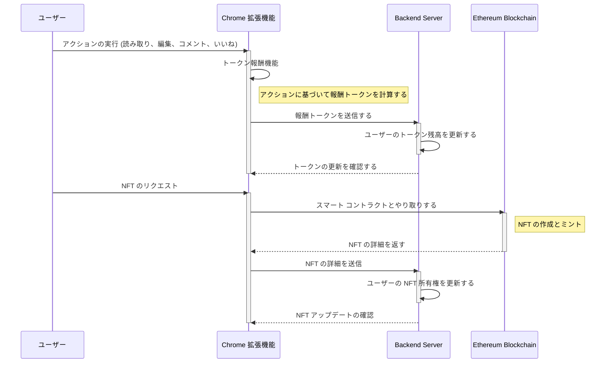

```mermaid
sequenceDiagram
participant ユーザー as ユーザー
participant 拡張機能 as Chrome 拡張機能
participant Backend as Backend Server
participant Blockchain as Ethereum Blockchain

ユーザー->>拡張機能: アクションの実行 (読み取り、編集、コメント、いいね)
activate 拡張機能
拡張機能->>拡張機能: トークン報酬機能
Note right of 拡張機能: アクションに基づいて報酬トークンを計算する
拡張機能->>Backend: 報酬トークンを送信する
activate Backend
Backend->>Backend: ユーザーのトークン残高を更新する
deactivate Backend
Backend-->>拡張機能: トークンの更新を確認する
deactivate 拡張機能

ユーザー->>拡張機能: NFT のリクエスト
activate 拡張機能
拡張機能->>Blockchain: スマート コントラクトとやり取りする
activate Blockchain
Note right of Blockchain: NFT の作成とミント
Blockchain-->>拡張機能: NFT の詳細を返す
deactivate Blockchain
拡張機能->>Backend: NFT の詳細を送信
activate Backend
Backend->>Backend: ユーザーの NFT 所有権を更新する
deactivate Backend
Backend-->>拡張機能: NFT アップデートの確認
deactivate 拡張機能
```
