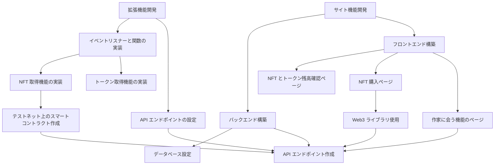

```mermaid
graph TD
A[拡張機能開発] --> B[イベントリスナーと関数の実装]
B --> C[NFT 取得機能の実装]
B --> D[トークン取得機能の実装]
C --> E[テストネット上のスマートコントラクト作成]
A --> F[API エンドポイントの設定]

G[サイト機能開発] --> H[バックエンド構築]
H --> I[データベース設定]
H --> J[API エンドポイント作成]
G --> K[フロントエンド構築]
K --> L[NFT とトークン残高確認ページ]
K --> M[NFT 購入ページ]
M --> N[Web3 ライブラリ使用]
K --> O[作家に会う機能のページ]

E --> J
F --> J
N --> J
O --> J
```
