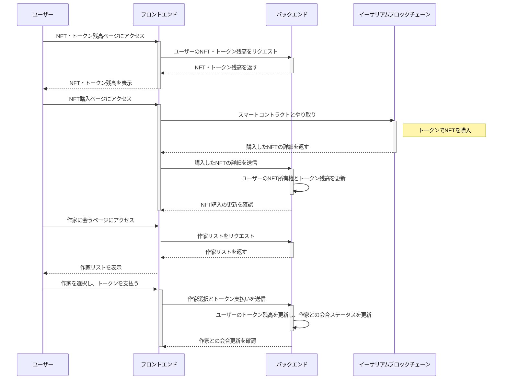

```mermaid
sequenceDiagram
participant ユーザー as ユーザー
participant フロントエンド as フロントエンド
participant バックエンド as バックエンド
participant イーサリアムブロックチェーン as イーサリアムブロックチェーン

ユーザー->>フロントエンド: NFT・トークン残高ページにアクセス
activate フロントエンド
フロントエンド->>バックエンド: ユーザーのNFT・トークン残高をリクエスト
activate バックエンド
バックエンド-->>フロントエンド: NFT・トークン残高を返す
deactivate バックエンド
フロントエンド-->>ユーザー: NFT・トークン残高を表示
deactivate フロントエンド

ユーザー->>フロントエンド: NFT購入ページにアクセス
activate フロントエンド
フロントエンド->>イーサリアムブロックチェーン: スマートコントラクトとやり取り
activate イーサリアムブロックチェーン
Note right of イーサリアムブロックチェーン: トークンでNFTを購入
イーサリアムブロックチェーン-->>フロントエンド: 購入したNFTの詳細を返す
deactivate イーサリアムブロックチェーン
フロントエンド->>バックエンド: 購入したNFTの詳細を送信
activate バックエンド
バックエンド->>バックエンド: ユーザーのNFT所有権とトークン残高を更新
deactivate バックエンド
バックエンド-->>フロントエンド: NFT購入の更新を確認
deactivate フロントエンド

ユーザー->>フロントエンド: 作家に会うページにアクセス
activate フロントエンド
フロントエンド->>バックエンド: 作家リストをリクエスト
activate バックエンド
バックエンド-->>フロントエンド: 作家リストを返す
deactivate バックエンド
フロントエンド-->>ユーザー: 作家リストを表示

ユーザー->>フロントエンド: 作家を選択し、トークンを支払う
activate フロントエンド
フロントエンド->>バックエンド: 作家選択とトークン支払いを送信
activate バックエンド
バックエンド->>バックエンド: ユーザーのトークン残高を更新し、作家との会合ステータスを更新
deactivate バックエンド
バックエンド-->>フロントエンド: 作家との会合更新を確認
deactivate フロントエンド
```
